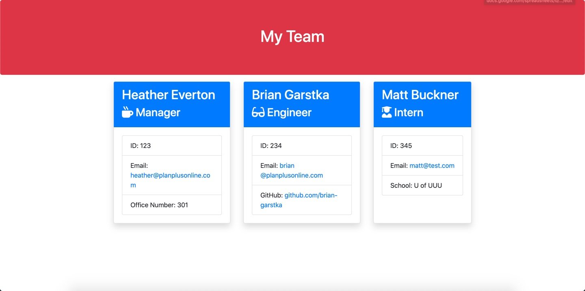

# Team-Profile-Generator

## Description
This is a simple Node.js application that can generate a website with your Team's information. 



<a href="https://github.com/heather-everton/Team-Profile-Generator"><strong>Explore the docs »</strong></a>
<br />
<a href="https://drive.google.com/file/d/1Sclf10NCXLUaL9arYSHldOtZrporza1R/view">View Demo</a>

## Table of Contents
* [Installation](#installation)
* [Usage](#usage)
* [Contributing](#contributing)
* [Tests](#tests)
* [Questions](#questions)


## Installation
To install necessary dependencies, run the following command:
```
npm install
npm install inquirer
```
## Usage
    This will generate a simple website that can be used to share your team's basic information. Use "node app" to run the file. The HTML file will be produced in the "dist/" folder.

## Contributing
If you're interested in contributing please reach out to me via email. 

## Tests
Test this application manually

## Questions
If you have any questions about the repo, open an issue or contact me directly at heathereverton88@gmail.com. You can find more of my work at (https://github.com/heather-everton/).

### Built With
* [JavaScript](https://javascript.com)
* [Node Js](https://nodejs.org/en/)
* [npm](https://www.npmjs.com/)

## Roadmap

See the [open issues](https://github.com/heather-everton/Team-Profile-Generator/issues) for a list of proposed features (and known issues).
